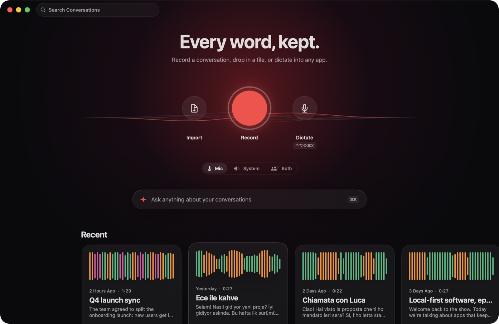
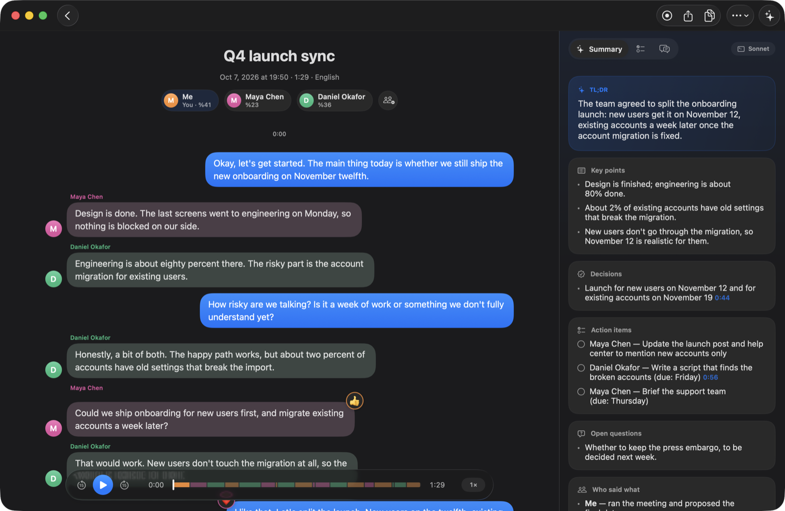
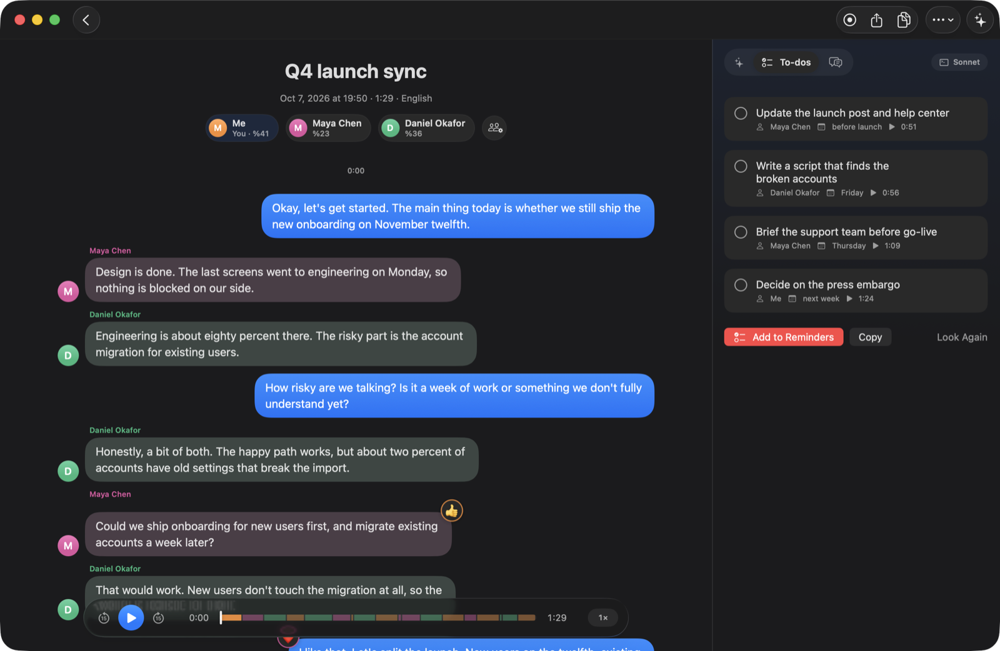
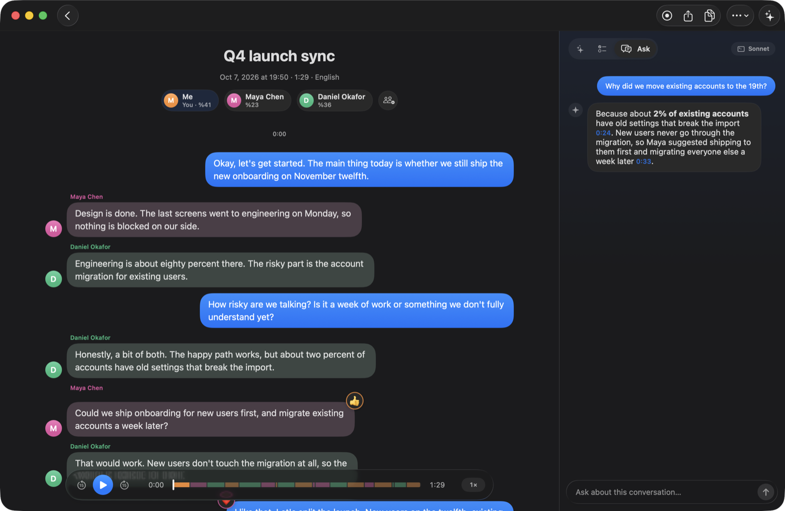
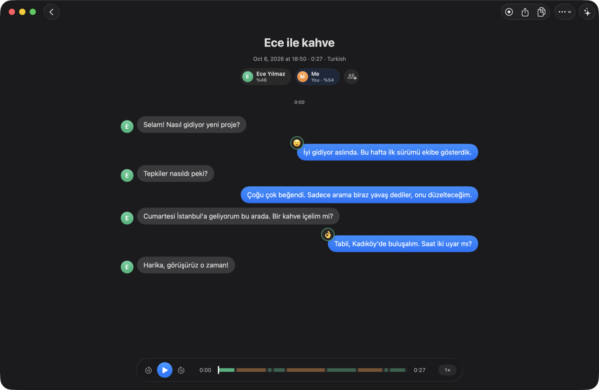

<div align="center">

# Transkribe

**Every word, kept.**

A private, local transcription app for macOS. Record calls and meetings, drop in any audio or video file, or dictate into any app, and read it all back as a chat, with summaries, to-dos and answers on top.

Speech recognition and speaker detection run entirely on your Mac.



</div>

## Features

**Record or import anything.** Record your microphone, your Mac's system audio (Zoom, Meet, FaceTime, a video), or both. Or drop any audio or video file onto the window, paste it with ⌘V, or press ⌘O. Any length, any format macOS can play. Transkribe notices when a call starts, offers to record it, names the recording from your calendar, and stops when the call ends.

**Live, and easy on your Mac.** Recordings are transcribed while you talk, in batches that never cut a sentence. Hours-long files use constant memory and resume after a quit. Work runs at background priority and pauses when the Mac is hot, on low battery or busy.

**Reads like a chat.** Your words appear on the right like sent messages, everyone else on the left. The spoken word lights up during playback, double-clicking a bubble plays it, and quick reactions ("Yeah", "Haha", "Aynen") become tapbacks on the message they respond to.



**Knows who said what.** Speakers are detected automatically and tuned for real calls. Rename people, merge two voices, move a bubble to another speaker, or link a voice to a person. Transkribe remembers voices and recognizes them in later recordings.

**Summaries, to-dos and answers.** One click writes a summary in the conversation's language: key points, decisions, action items with owners, and open questions, each linked to the moment it was said. Pull out to-dos and send them to Reminders, or ask questions about one conversation or your whole library.

<table>
  <tr>
    <td></td>
    <td></td>
  </tr>
</table>

**Pick your model.** Claude through your existing [Claude Code](https://claude.com/claude-code) login (no setup), Apple Intelligence fully on-device, or Claude with an API key stored in the Keychain.

**Many languages.** Whisper handles almost any language; Parakeet is used for European languages where it is faster and more accurate. Pick the languages you speak and each stretch of audio is locked to one of them, which avoids misdetections and repetition loops. Search ignores accents, and Turkish ı/İ just works.



**Dictate anywhere.** Press the dictation shortcut in any app, speak, and press Return to type it into the focused field. Add names and jargon to your vocabulary so they come out right.

**Export and connect.** Copy or export as text, Markdown, PDF or subtitles (`.srt`). A built-in [MCP](https://modelcontextprotocol.io) server lets AI tools like Claude Code search and read your conversations.

## Privacy

Audio never leaves your Mac. Transcription uses [WhisperKit](https://github.com/argmaxinc/WhisperKit), Parakeet and Apple's speech recognizer, and speaker detection uses [FluidAudio](https://github.com/FluidInference/FluidAudio), all running locally. Only the text you choose to summarize or ask about is sent, and only to the model you picked. With Apple Intelligence, even that stays on-device. There is no account, server or analytics.

## Install

Transkribe needs macOS 14 or later on Apple Silicon. Liquid Glass is used on macOS 26.

Build it from source with Xcode 16 or later (the command line tools are enough):

```bash
git clone https://github.com/kayraucklnc/transkribe.git
cd transkribe
scripts/build-app.sh --install   # builds and copies Transkribe.app to /Applications
```

`scripts/make-dmg.sh` builds a drag-to-Applications disk image instead. On first launch Transkribe downloads its speech models (about 650 MB, or 1 GB for the most accurate setting) and optimizes them for your Mac. That happens once; after that it works offline.

### Permissions

- **Microphone**: asked the first time you record with the mic.
- **System audio**: listed under *System Settings → Privacy & Security → Screen & System Audio Recording*. Only audio is captured, never the screen.
- **Accessibility** (optional): lets dictation type into other apps.
- **Calendar** (optional): names recordings after the meeting you're in.
- **Contacts** and **Reminders** (optional): link speakers to people you know, and send to-dos to Reminders.

Local builds are ad-hoc signed, so macOS may ask for permissions again after you rebuild. Set `DEVELOPER_ID="Developer ID Application: Your Name (TEAMID)"` before running `build-app.sh` to sign for distribution.

### Use it from Claude Code

```bash
claude mcp add transkribe /Applications/Transkribe.app/Contents/MacOS/transkribe-mcp
```

Claude can then list, search and read your conversations and the people in them.

## Where things live

| What | Where |
| --- | --- |
| Conversations & audio | `~/Library/Application Support/Transkribe/Library/<id>/` |
| People | `~/Library/Application Support/Transkribe/people.json` |
| Speech models | `~/Library/Application Support/Transkribe/Models/` |

Each conversation is a folder with `transcript.json` and its audio. Delete a folder to remove it. Set `TRANSKRIBE_HOME` to point the app at a different folder.

## Development

```bash
swift build
swift test                                                                  # unit tests
TRANSKRIBE_INTEGRATION=1 swift test --filter TranscriptionIntegrationTests  # real models, downloads ~650 MB
```

The screenshots above use a fictional library voiced by macOS `say`. To recreate it:

```bash
TRANSKRIBE_DEMO_HOME=/tmp/transkribe-demo swift test --filter DemoLibraryTests
scripts/build-app.sh && open --env TRANSKRIBE_HOME=/tmp/transkribe-demo build/Transkribe.app
```

### Layout

- `Sources/TranskribeCore`: everything that isn't UI.
  - `Engines/`, `TranscriptionEngine`, `DiarizationEngine`, `VoiceprintEngine`: speech recognition, speaker detection and voice matching.
  - `Pipeline/`: the windowed, resumable transcription pipeline (`WindowPlanner`, `TrackTranscriber`, `PCMStore`, `ResourceGovernor`).
  - `Recording/`: microphone and system audio capture.
  - `AI/`: model providers, `Summarizer`, `Assistant`, `ActionItems` and prompts.
  - `Agent/`: the MCP server and library tools.
  - Storage, search, chat layout, reactions, export and formatting.
- `Sources/Transkribe`: the SwiftUI app. State lives in `AppModel`, playback in `PlayerController`, views in `Views/`, call detection in `Calls/` and dictation in `Dictation/`.
- `Sources/TranskribeMCP`: the `transkribe-mcp` command-line MCP server.

Issues and pull requests are welcome.

## License

[MIT](LICENSE)
